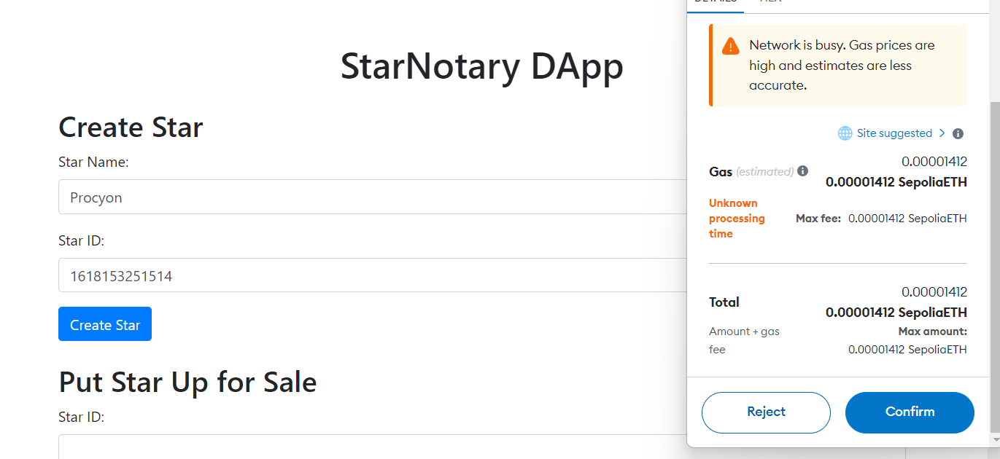
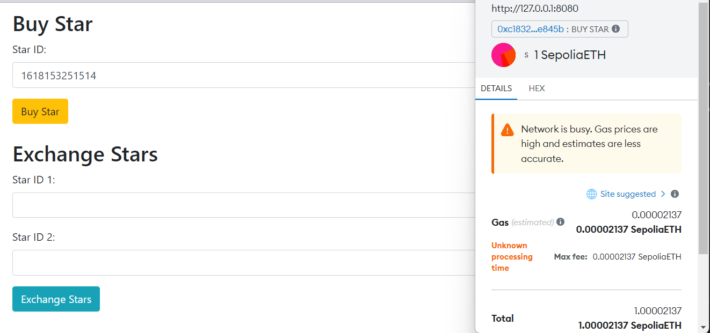
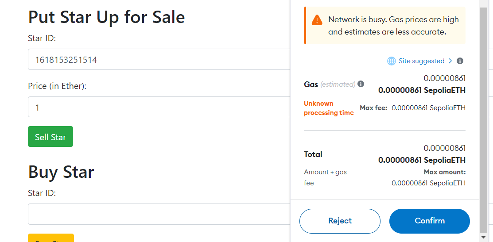
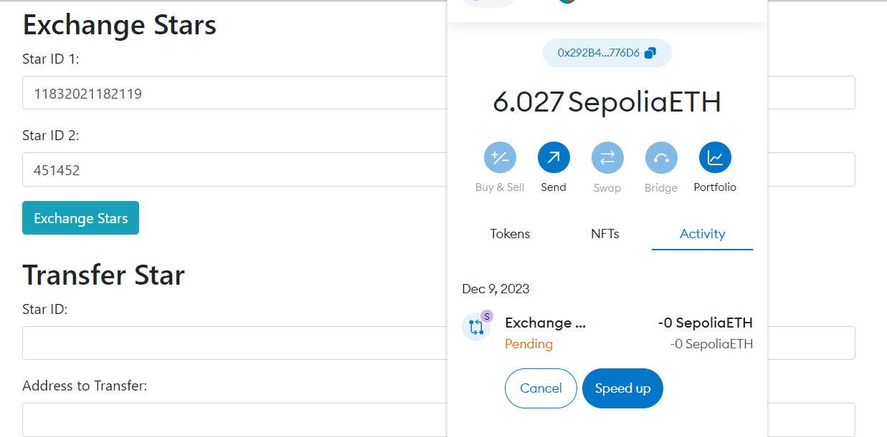
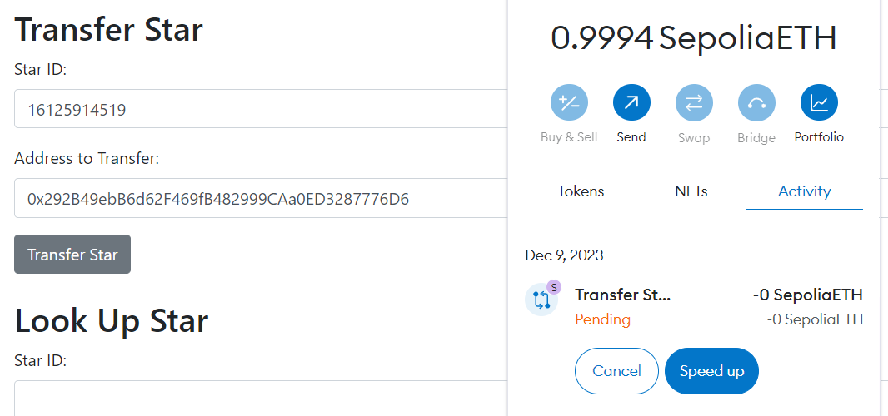

# StarNotary DApp User Guide

Welcome to the StarNotary DApp User Guide. This guide provides step-by-step instructions on how to use the StarNotary Decentralized Application (DApp) for creating, buying, selling, exchanging, and transferring unique digital stars on the Ethereum blockchain.

## Table of Contents
- [StarNotary DApp User Guide](#starnotary-dapp-user-guide)
  - [Table of Contents](#table-of-contents)
    - [Creating a Star](#creating-a-star)
    - [Buying a Star](#buying-a-star)
    - [Selling a Star](#selling-a-star)
    - [Exchanging Stars](#exchanging-stars)
    - [Transferring a Star](#transferring-a-star)

### Creating a Star
1. Open the StarNotary DApp in your web browser.
2. Connect your Ethereum wallet (e.g., MetaMask) to the DApp.
3. Navigate to the 'Create Star' section.
4. Enter the name of your star in the 'Star Name' field.
5. Enter a unique ID for your star in the 'Star ID' field.
6. Click the 'Create Star' button.
7. Confirm the transaction in your wallet.

   

### Buying a Star
1. Go to the 'Buy Star' section.
2. Enter the ID of the star you wish to purchase in the 'Star ID' field.
3. Click the 'Buy Star' button.
4. Confirm the transaction and the payment in your wallet.

   

### Selling a Star
1. Navigate to the 'Sell Star' section.
2. Enter the ID of the star you want to sell in the 'Star ID' field.
3. Set a price for your star in the 'Price' field.
4. Click the 'Sell Star' button.
5. Approve the transaction in your wallet.

   

### Exchanging Stars
1. Access the 'Exchange Stars' section.
2. Enter the ID of the first star in the 'Star ID 1' field.
3. Enter the ID of the second star in the 'Star ID 2' field.
4. Click the 'Exchange Stars' button.
5. Confirm the exchange transaction in your wallet.

   

### Transferring a Star
1. Go to the 'Transfer Star' section.
2. Input the ID of the star you wish to transfer in the 'Star ID' field.
3. Enter the Ethereum address of the recipient in the 'Recipient Address' field.
4. Click the 'Transfer Star' button.
5. Validate the transfer in your wallet.

   

For additional support or inquiries, please contact [thepolyglot8@gmail.com](mailto:thepolyglot8@gmail.com).

